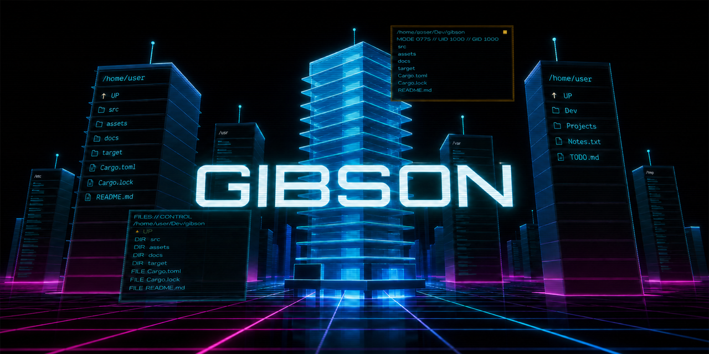

# GIBSON



"...i'm in this computer, right, so i'm looking around, i'm lookin' around, yknow, throwin' commands at it, i don't know where it is or what it does or anything... it's like-it's like *choice*, **it's just beautiful**..."

	- **Joey Pardella** *(as played by Jesse Bradford)*, *Hackers* (1995)

GIBSON turns directory changes into cinematic flights through a file-system city.

Each directory is a tower. Its direct children form the tower storeys.

Use the built-in Bash terminal or file navigator. The 3D view follows your journey through the city.

GIBSON targets [Omarchy](https://omarchy.org/) first. It also runs on other Arch Linux Wayland desktops.

## Install

Install the official binary package from the AUR:

```bash
yay -S gibson-ui-bin
```

You can use another AUR helper instead of `yay`.

Open **GIBSON** from your desktop launcher. The launcher also provides a **Cockpit mode** action.

You can start either mode from a terminal:

```bash
gibson-ui
gibson-ui --cockpit
```

The normal command respects the current window rules. Cockpit mode selects an empty Hyprland workspace and opens fullscreen.

Cockpit mode opens fullscreen without workspace control when Hyprland is not available.

## Optional Omarchy keybind

GIBSON does not change your Hyprland settings.

Add this line to `~/.config/hypr/bindings.conf` if you want a cockpit keybind:

```ini
bindd = SUPER CTRL, G, GIBSON cockpit, exec, uwsm-app -- gibson-ui --cockpit
```

Change the key combination if it conflicts with your settings.

## Omarchy integration

GIBSON reads the active Omarchy palette and background. A theme change updates the running application.

It also reads the Foot font and colour settings. Included Foot configuration files work as expected.

GIBSON only reads these files. It does not change Omarchy, Hyprland, or terminal settings.

Other Wayland systems use the built-in GIBSON palette. They can still use the user Foot configuration.

## Controls

GIBSON starts with terminal control. Press `F2` to give control to the file navigator.

| Input | Result |
|---|---|
| `F2` | Change between terminal and file-navigator control |
| `F3` | Show or hide the terminal pane |
| `F4` | Show or hide the file navigator |
| `F10` | Open or close settings |
| `F11` | Change the fullscreen state |
| Up or Down | Select a file-navigator item |
| Left or Right | Orbit by one tower face |
| `R` | Return the orbit to the initial face |
| Page Up or Page Down | Move eight file-navigator items |
| Home or End | Select the first or last item |
| `Enter` on a directory | Change directory through a direct flight |
| `Enter` on a file | Open the file with its default application |
| `Backspace` | Change to the parent directory |
| `Escape` | Give control to the terminal |
| Left click | Select the panel that receives input |
| Left drag on a splitter | Resize the cockpit panes |
| Mouse wheel | Change the selected file |

The settings screen uses Up and Down for selection. Use Left and Right to change a value.

## What it does

- Renders a bounded directory tree with native Rust and `wgpu`.
- Runs the user's Bash environment in a real PTY.
- Supports ANSI colour, Unicode, Nerd Font, and Powerline prompts.
- Shows a responsive file menu on the active tower face.
- Shows file metadata and bounded directory previews.
- Uses direct flights for file-navigator changes.
- Uses complete directory routes for terminal changes.
- Keeps the same city route in both directions.
- Shows effects for create, remove, rename, move, and modify events.
- Plays an ambient score, flight sounds, and navigator feedback.
- Fades all audio when the application loses focus.
- Provides wide cockpit and compact drawer layouts.
- Stores splitter positions and pane visibility.
- Provides four quality levels and four frame-rate modes.
- Shows live performance data in the visualiser HUD.

The file navigator does not change file-system data. Use the terminal for write operations.

## Settings

Press `F10` to change graphics, motion, audio, theme, and frame-rate settings.

GIBSON stores changed settings in `$XDG_CONFIG_HOME/gibson/gibson.toml`.

It uses `~/.config/gibson/gibson.toml` when `XDG_CONFIG_HOME` is not set.

The default settings do not require a file:

```toml
[graphics]
quality = "high"
frame_rate = "fps60"
floor_pulses = true
scanlines = true
motion_scale = 1.0
performance_log = false

[appearance]
follow_omarchy = true
backdrop = "tint"

[behaviour]
orbit_enabled = true
idle_sweep = true

[audio]
enabled = true
master_volume = 0.65
```

The backdrop accepts `off`, `tint`, or `wallpaper`. Wallpaper mode requires Omarchy.

The frame rate accepts `fps30`, `fps60`, `fps120`, or `unlimited`.

## Command options

Start at a selected directory:

```bash
gibson-ui ~/Dev
```

Start at the file-system root:

```bash
gibson-ui --root
```

Open without cockpit workspace control:

```bash
gibson-ui --fullscreen
```

Remove the application frame limit and print performance data:

```bash
gibson-ui --uncapped --perf
```

Run `gibson-ui --help` for all options.

## Build from source

The build requires a recent stable Rust toolchain and these native libraries:

- ALSA.
- Wayland.
- `libxkbcommon`.
- A Vulkan loader and driver.

Build and test the public version:

```bash
cargo test --frozen
cargo build --frozen --release
./target/release/gibson-ui
```

The public build contains small original fallback sounds. Official binaries contain the complete Mixkit soundscape.

The Mixkit source files are not part of this repository. See [the sound asset notes](assets/sounds/README.md).

## Performance

The default `high` setting targets 60 frames per second on a six-year-old Radeon Vega laptop.

Use `balanced` or `performance` for more GPU headroom. Use `cinematic` for more objects and labels.

The HUD shows frame rate, CPU frame time, and visible scene counts.

Use `--perf` to print detailed frame statistics every two seconds.

## Privacy and safety

GIBSON does not send paths, commands, terminal output, or file names over the network.

The file navigator opens files and changes directories. It does not create, move, copy, or remove items.

File names do not enter generated shell source. The Bash bridge reads exact paths from a user-only control file.

## Current limits

- Bash is the only shell with two-way directory synchronisation.
- The terminal does not support text selection or clipboard operations.
- The directory index stops after 250,000 directories.
- The visualiser shows no more than 128 towers at one time.
- Tower sizes use direct-child data instead of recursive disk usage.
- Tower labels use screen-facing text instead of textured geometry.
- The renderer does not contain a bloom post-process.

## Development

Run all tests and strict static checks:

```bash
cargo test --frozen --all-features
cargo clippy --frozen --all-targets --all-features -- -D warnings
```

See [ROADMAP.md](ROADMAP.md) for planned work.

## Licence

The GIBSON source code and original fallback sounds use the [MIT licence](LICENSE).

Michroma uses the SIL Open Font License 1.1. Official audio uses the Mixkit Sound Effects Free License.

Read [THIRD_PARTY.md](THIRD_PARTY.md) for asset details. Release archives also contain all Rust dependency licence texts.
